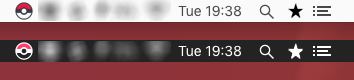

# Pokemon GO servers status

Check the status of the Pokemon GO servers from your Menubar (MacOS only)



color code: <br/>
- green: server up<br/>
- orange: server unstable<br/>
- red: server down<br/>

## Installation

Just download ``` Pokemon.GO.Status.app.zip ``` from the [release page](https://github.com/Lacsap-/pokemon-go-status/releases/tag/0.1), unzip it, put it in your application folder and launch it!

Optionally you can launch it on startup start by going in your mac setting under ``` Users & Groups ``` and dragging the application in your ``` login items ```.

## Making .app from source

- Install requirements

``` pip install -r requirements.txt ```

- Build the .app

``` python setup.py py2app ```
